# RabbitMQ Implementation with .NET

What is RabbitMQ? follow this video: https://youtu.be/7rkeORD4jSw?si=9P1PQNRJ8XGUGvNP


This document explains how RabbitMQ messaging is implemented using .Net:

- **Orchestration** — an ASP.NET Core Web API that owns instrument data and **publishes** an event whenever an instrument's status changes.
- **InstrumentsApp** — a Blazor Server app that **consumes** that event and updates its UI live.


## RabbitMQ concepts used here

RabbitMQ is a **message broker**: a separate server that sits between applications and passes messages between them, so the applications never have to know about or call each other directly. Four pieces of vocabulary matter for this implementation:

| Term | What it is |
|---|---|
| **Exchange** | The thing a publisher sends a message *to*. An exchange doesn't store anything — its only job is to decide which queue(s), if any, should receive a copy of the message. |
| **Queue** | Where messages actually sit and wait, until a consumer reads them. A queue is a buffer, owned by whichever application declared it. |
| **Binding** | The rule connecting an exchange to a queue — "route messages matching *this* pattern into *that* queue." Without a binding, a queue never receives anything, no matter what's published to the exchange. |
| **Routing key** | A string attached to a message by the publisher (e.g. `instrument.status.changed`). The exchange uses it, together with each binding's pattern, to decide where the message goes. |

## Architecture

```mermaid
flowchart LR
    subgraph P["Orchestration — publishes"]
        API["Orchestration.WebAPI<br/>PUT /Instruments/{id}"]
        SVC["InstrumentService"]
        PROD["EventMessageProducer&lt;T&gt;"]
        API --> SVC --> PROD
    end

    subgraph B["RabbitMQ broker"]
        EX{{"orchestration.instruments<br/>topic exchange"}}
        Q[["instruments-app.instrument-status-changed<br/>queue"]]
        EX -- "instrument.status.changed" --> Q
    end

    subgraph C["InstrumentsApp — consumes"]
        HOST["RabbitConsumerHostedService&lt;T&gt;"]
        PROC["InstrumentStatusChangeMessageProcessor"]
        UI["Blazor UI"]
        HOST --> PROC --> UI
    end

    PROD -- publish --> EX
    Q -- consume --> HOST
```



Orchestration never talks to InstrumentsApp directly, and InstrumentsApp never talks to Orchestration to receive an update — both only talk to RabbitMQ. That's the whole point of using a broker: the two applications can be deployed, restarted, or scaled independently.

## Exchange type

The exchange is declared as a **topic** exchange:

```json
{ "Name": "orchestration.instruments", "Type": "Topic", "Durable": true }
```

RabbitMQ supports a few exchange types; the one that matters here alongside topic is:

- **Direct** — a queue's binding key must be an *exact* match of the message's routing key.
- **Topic** — a queue's binding key can be a *pattern*, using `*` to mean "exactly one word" and `#` to mean "zero or more words," where "words" are the dot-separated segments of the routing key.

Right now, the binding uses the exact routing key `instrument.status.changed` with no wildcards:

```json
{ "Exchange": "orchestration.instruments",
  "Queue": "instruments-app.instrument-status-changed",
  "RoutingKey": "instrument.status.changed" }
```

So functionally, today, it behaves exactly like a direct exchange — one specific routing key, one specific queue. The reason it's declared as `Topic` instead of `Direct` is that topic is a strict superset: everything a direct exchange can do, a topic exchange can also do, plus pattern matching. That leaves room to scale this without changing the exchange itself:

- A future consumer could bind a queue to `instrument.status.*` — pattern-matches only status-related instrument events.
- A future consumer could bind a queue to `instrument.#` — pattern-matches *every* instrument event, whatever comes after `instrument.`.
- The producer wouldn't change at all — it already publishes with a specific routing key; adding consumers with wildcard bindings is entirely additive, done from the consumer's own config.

If the exchange had been declared `Direct` instead, none of that would be available later without dropping and redeclaring it as `Topic` — a breaking change to existing bindings.

## RabbitMQ configuration

Both projects bind a `Rabbit` section from `appsettings.json` into a `RabbitSettings` object. The two files aren't identical — each app only fills in the parts it actually uses.

**Orchestration.WebAPI — publishes only, so `Queues`, `Bindings`, and `Consumers` are empty:**

```json
"Rabbit": {
  "Connections": [
    { "Name": "OrchestrationRabbitPublisher", "Server": "localhost",
      "UserName": "guest", "Password": "guest" }
  ],
  "Publishers": [
    { "Name": "InstrumentStatusChangeMessage",
      "Connection": "OrchestrationRabbitPublisher",
      "Exchange": "orchestration.instruments" }
  ],
  "Schema": {
    "Exchanges": [
      { "Name": "orchestration.instruments",
        "Connection": "OrchestrationRabbitPublisher",
        "Type": "Topic", "Durable": true }
    ],
    "Queues": [],
    "Bindings": []
  },
  "Consumers": []
}
```

**InstrumentsApp — consumes only, so `Publishers` is empty:**

```json
"Rabbit": {
  "Connections": [
    { "Name": "InstrumentsAppRabbitConsumer", "Server": "localhost",
      "UserName": "guest", "Password": "guest" }
  ],
  "Publishers": [],
  "Schema": {
    "Exchanges": [
      { "Name": "orchestration.instruments",
        "Connection": "InstrumentsAppRabbitConsumer",
        "Type": "Topic", "Durable": true }
    ],
    "Queues": [
      { "Name": "instruments-app.instrument-status-changed",
        "Connection": "InstrumentsAppRabbitConsumer", "Durable": true }
    ],
    "Bindings": [
      { "Exchange": "orchestration.instruments",
        "Queue": "instruments-app.instrument-status-changed",
        "RoutingKey": "instrument.status.changed" }
    ]
  },
  "Consumers": [
    { "Name": "InstrumentStatusChangeMessage",
      "Connection": "InstrumentsAppRabbitConsumer",
      "Queue": "instruments-app.instrument-status-changed" }
  ]
}
```


### What each field means

| Section | Purpose |
|---|---|
| `Connections` | Broker endpoints this app can open a connection to — host, credentials. Named, so more than one can exist. |
| `Publishers` | Maps a .NET message type name to the connection + exchange it should be published through. |
| `Schema.Exchanges` | Exchanges this app expects to exist — declared (created, if missing) on startup. |
| `Schema.Queues` | Queues this app owns and consumes from — declared on startup. |
| `Schema.Bindings` | The routing rules linking an exchange to a queue. |
| `Consumers` | Maps a .NET message type name to the connection + queue it should be consumed from. |

That whole shape is bound in C# with one call, once, at startup — nothing about a host name, exchange, or queue is hardcoded anywhere else:

```csharp
var rabbitSettings = builder.Configuration.GetSection("Rabbit").Get<RabbitSettings>()
    ?? throw new InvalidOperationException("Missing 'Rabbit' configuration section.");
builder.Services.AddSingleton(rabbitSettings);
```

`RabbitSettings` is the C# model the JSON binds into:

```csharp
public class RabbitSettings
{
    public required List<RabbitConnectionSettings> Connections { get; set; }
    public required List<RabbitPublisherSettings> Publishers { get; set; }
    public required RabbitSchemaSettings Schema { get; set; }
    public List<RabbitConsumerSettings> Consumers { get; set; } = [];
}

public class RabbitConnectionSettings
{
    public required string Name { get; set; }
    public required string Server { get; set; }
    public required string UserName { get; set; }
    public required string Password { get; set; }
}

public class RabbitPublisherSettings
{
    public required string Name { get; set; }
    public required string Connection { get; set; }
    public required string Exchange { get; set; }
}

public class RabbitSchemaSettings
{
    public List<RabbitExchangeSettings> Exchanges { get; set; } = [];
    public List<RabbitQueueSettings> Queues { get; set; } = [];
    public List<RabbitBindingSettings> Bindings { get; set; } = [];
}

public class RabbitExchangeSettings
{
    public required string Name { get; set; }
    public required string Connection { get; set; }
    public required string Type { get; set; }
    public bool Durable { get; set; }
}

public class RabbitQueueSettings
{
    public required string Name { get; set; }
    public required string Connection { get; set; }
    public bool Durable { get; set; }
}

public class RabbitBindingSettings
{
    public required string Exchange { get; set; }
    public required string Queue { get; set; }
    public required string RoutingKey { get; set; }
}

public class RabbitConsumerSettings
{
    public required string Name { get; set; }
    public required string Connection { get; set; }
    public required string Queue { get; set; }
}
```

## Shared infrastructure

Both apps use two identical building blocks

### Connecting to the broker

Opening a connection to RabbitMQ is relatively expensive — it's a real TCP handshake plus an AMQP protocol negotiation. `RabbitConnectionProvider` opens one connection per named `Connection` entry and reuses it, handing out a cheap new channel for every actual publish or consume:

```csharp
public class RabbitConnectionProvider(RabbitSettings rabbitSettings) : IRabbitConnectionProvider, IAsyncDisposable
{
    private readonly ConcurrentDictionary<string, Lazy<Task<IConnection>>> _connections = new();

    public async Task<IChannel> CreateChannelAsync(string connectionName)
    {
        var connection = await _connections.GetOrAdd(connectionName,
            name => new Lazy<Task<IConnection>>(() => OpenConnectionAsync(name))).Value;

        return await connection.CreateChannelAsync();
    }

    private Task<IConnection> OpenConnectionAsync(string connectionName)
    {
        var settings = rabbitSettings.Connections.FirstOrDefault(c => c.Name == connectionName)
            ?? throw new InvalidOperationException($"No Rabbit connection configured with name '{connectionName}'.");

        var factory = new ConnectionFactory
        {
            HostName = settings.Server,
            UserName = settings.UserName,
            Password = settings.Password
        };

        return factory.CreateConnectionAsync();
    }

    public async ValueTask DisposeAsync()
    {
        foreach (var lazyConnection in _connections.Values)
        {
            if (!lazyConnection.IsValueCreated) continue;
            var connection = await lazyConnection.Value;
            await connection.DisposeAsync();
        }
    }
}
```

### Creating exchanges, queues, and bindings

Exchanges and queues have to actually be created on the broker before anyone can publish to or consume from them — this is called "declaring" them. `RabbitTopologyInitializer` reads every exchange, queue, and binding out of config and declares them once, at application startup:

```csharp
public class RabbitTopologyInitializer(IRabbitConnectionProvider connectionProvider, RabbitSettings rabbitSettings) : IRabbitTopologyInitializer
{
    public async Task DeclareTopologyAsync()
    {
        foreach (var exchange in rabbitSettings.Schema.Exchanges)
        {
            await using var channel = await connectionProvider.CreateChannelAsync(exchange.Connection);

            await channel.ExchangeDeclareAsync(exchange: exchange.Name,
                type: exchange.Type.ToLowerInvariant(),
                durable: exchange.Durable,
                autoDelete: false,
                arguments: null);
        }

        foreach (var queue in rabbitSettings.Schema.Queues)
        {
            await using var channel = await connectionProvider.CreateChannelAsync(queue.Connection);

            await channel.QueueDeclareAsync(queue: queue.Name,
                durable: queue.Durable,
                exclusive: false,
                autoDelete: false,
                arguments: null);
        }

        foreach (var binding in rabbitSettings.Schema.Bindings)
        {
            var queue = rabbitSettings.Schema.Queues.FirstOrDefault(q => q.Name == binding.Queue)
                ?? throw new InvalidOperationException($"No Rabbit queue configured with name '{binding.Queue}'.");

            await using var channel = await connectionProvider.CreateChannelAsync(queue.Connection);

            await channel.QueueBindAsync(queue: binding.Queue,
                exchange: binding.Exchange,
                routingKey: binding.RoutingKey,
                arguments: null);
        }
    }
}
```

This runs once, right after the app is built and before it starts serving traffic:

```csharp
var app = builder.Build();

await app.Services.GetRequiredService<IRabbitTopologyInitializer>().DeclareTopologyAsync();
```

Declaring is safe to repeat — the broker just confirms it already exists with the same settings — so running it on every startup is normal, not wasteful.

## Producer: Orchestration

### The message contract

A message is a small, purpose-built record — not the internal domain model. `InstrumentStatusChangeMessage` is what actually goes on the wire:

```csharp
public record InstrumentStatusChangeMessage(
    Guid InstrumentId,
    string Name,
    [property: JsonConverter(typeof(StringEnumConverter))] InstrumentStatus Status,
    DateTimeOffset ChangedAtUtc);
```

The `[JsonConverter(typeof(StringEnumConverter))]` on `Status` matters: without it, Newtonsoft.Json would serialize the `InstrumentStatus` enum as a plain number (`0`, `1`), which only means something if the reader has the exact same enum with the exact same ordering. Serializing it as the string `"Available"` / `"Unavailable"` instead means any consumer can read it correctly regardless of how its own enum (or type) is defined.

### Publishing a message

`IEventMessageProducer<T>` is the publish-side contract:

```csharp
public interface IEventMessageProducer<in T> where T : class
{
    Task<string> PublishAsync(T item, string routingKey);
}
```

`EventMessageProducer<T>` implements it. It looks up which exchange to publish `T` to from config (matching on the .NET type's name), gets a channel from the connection provider, and publishes:

```csharp
public class EventMessageProducer<T>(IRabbitConnectionProvider connectionProvider, RabbitSettings rabbitSettings) : IEventMessageProducer<T> where T : class
{
    public async Task<string> PublishAsync(T item, string routingKey)
    {
        var messageName = typeof(T).Name;

        var publisher = rabbitSettings.Publishers.FirstOrDefault(p => p.Name == messageName)
            ?? throw new InvalidOperationException($"No Rabbit publisher configured for message '{messageName}'.");

        var exchange = rabbitSettings.Schema.Exchanges.FirstOrDefault(e => e.Name == publisher.Exchange)
            ?? throw new InvalidOperationException($"No Rabbit exchange configured with name '{publisher.Exchange}'.");

        await using var channel = await connectionProvider.CreateChannelAsync(publisher.Connection);

        var json = JsonConvert.SerializeObject(item);
        var body = Encoding.UTF8.GetBytes(json);

        var properties = new BasicProperties
        {
            Persistent = exchange.Durable
        };

        await channel.BasicPublishAsync(exchange: exchange.Name,
            routingKey: routingKey,
            mandatory: false,
            basicProperties: properties,
            body: new ReadOnlyMemory<byte>(body));

        return $"Published {messageName} to exchange '{exchange.Name}' with routing key '{routingKey}'";
    }
}
```

Because the lookup key is `typeof(T).Name`, adding a brand-new message type never touches this class — it's purely a matter of adding a new `Publishers` entry in config and calling `PublishAsync` with the new type.

### Where the publish is triggered

`InstrumentService.UpdateInstrument` is what actually calls it, after an instrument's status has been changed in the data store:

```csharp
public class InstrumentService(
    InMemoryDataStore dataStore,
    IEventMessageProducer<InstrumentStatusChangeMessage> eventMessageProducer) : IInstrumentService
{
    private const string InstrumentStatusChangedRoutingKey = "instrument.status.changed";

    public async Task<Instrument?> UpdateInstrument(Instrument instrument)
    {
        var updated = dataStore.UpdateInstrument(instrument);
        if (updated is null)
        {
            return null;
        }

        var message = new InstrumentStatusChangeMessage(updated.InstrumentId, updated.Name, updated.Status, DateTimeOffset.UtcNow);
        await eventMessageProducer.PublishAsync(message, InstrumentStatusChangedRoutingKey);

        return updated;
    }
}
```

If the update failed (instrument not found), nothing is published — the message only goes out once the change is confirmed to have actually happened.

### Wiring it up (`Program.cs`)

```csharp
builder.Services.AddScoped(typeof(IEventMessageProducer<>), typeof(EventMessageProducer<>));
builder.Services.AddSingleton<IRabbitConnectionProvider, RabbitConnectionProvider>();
builder.Services.AddSingleton<IRabbitTopologyInitializer, RabbitTopologyInitializer>();
```

Registering `IEventMessageProducer<>` as an **open generic** means the same registration serves `IEventMessageProducer<InstrumentStatusChangeMessage>`, and any future `IEventMessageProducer<TAnythingElse>`, without adding a new line per message type.

## Consumer: InstrumentsApp

### The message contract

InstrumentsApp defines its *own* copy of the message record — it is not the same .NET type as Orchestration's, only the same JSON shape:

```csharp
public record InstrumentStatusChangeMessage(Guid InstrumentId, string Name, string Status, DateTimeOffset ChangedAtUtc);
```

`Status` is a plain `string` here rather than an enum — it doesn't need to know about Orchestration's `InstrumentStatus` type at all, it just needs the string value that arrives on the wire (which, thanks to `StringEnumConverter` on the producer side, is `"Available"` / `"Unavailable"`).

### Consuming messages

`RabbitConsumerHostedService<T>` is a generic [`BackgroundService`](https://learn.microsoft.com/dotnet/core/extensions/workers) — a class .NET runs for the lifetime of the app, in the background, alongside the web server:

```csharp
public class RabbitConsumerHostedService<T>(
    IRabbitConnectionProvider connectionProvider,
    RabbitSettings rabbitSettings,
    IServiceScopeFactory scopeFactory,
    ILogger<RabbitConsumerHostedService<T>> logger) : BackgroundService where T : class
{
    private IChannel? _channel;

    protected override async Task ExecuteAsync(CancellationToken stoppingToken)
    {
        var messageName = typeof(T).Name;

        var consumerSettings = rabbitSettings.Consumers.FirstOrDefault(c => c.Name == messageName)
            ?? throw new InvalidOperationException($"No Rabbit consumer configured for message '{messageName}'.");

        _channel = await connectionProvider.CreateChannelAsync(consumerSettings.Connection);
        await _channel.BasicQosAsync(0, 1, false, stoppingToken);

        var consumer = new AsyncEventingBasicConsumer(_channel);
        consumer.ReceivedAsync += async (_, deliverEventArgs) =>
        {
            try
            {
                var json = Encoding.UTF8.GetString(deliverEventArgs.Body.Span);
                var message = JsonConvert.DeserializeObject<T>(json);

                if (message is not null)
                {
                    await using var scope = scopeFactory.CreateAsyncScope();
                    var processor = scope.ServiceProvider.GetRequiredService<IMessageProcessor<T>>();
                    await processor.ProcessAsync(message, stoppingToken);
                }

                await _channel.BasicAckAsync(deliverEventArgs.DeliveryTag, false, stoppingToken);
            }
            catch (Exception ex)
            {
                logger.LogError(ex, "Failed to process {MessageName} message", messageName);
                await _channel.BasicNackAsync(deliverEventArgs.DeliveryTag, false, requeue: true, stoppingToken);
            }
        };

        await _channel.BasicConsumeAsync(consumerSettings.Queue, autoAck: false, consumer: consumer, cancellationToken: stoppingToken);
    }

    public override async Task StopAsync(CancellationToken cancellationToken)
    {
        if (_channel is not null)
        {
            await _channel.CloseAsync(cancellationToken);
        }

        await base.StopAsync(cancellationToken);
    }
}
```

A few details worth calling out for anyone new to this:

- **`BasicQosAsync(0, 1, false, ...)`** — tells RabbitMQ "only ever send me one unacknowledged message at a time." Without this, the broker would push every ready message at once.
- **`autoAck: false`** — the consumer, not the broker, decides when a message counts as "done." A message stays on the queue (invisible to other consumers, but not deleted) until it's explicitly acknowledged.
autoAck: true would mean the broker considers a message handled the instant it's put on the wire to the consumer — before your code has even run. If the consumer crashes mid-ProcessAsync, that message is already gone from the broker's perspective. No redelivery, no second chance, silently lost. 
We chose autoAck: false — manual acknowledgment.
- **`BasicAckAsync`** — "I successfully processed this, you can delete it now."
- **`BasicNackAsync(..., requeue: true)`** — "something went wrong, put it back on the queue" (used here inside the `catch` block, so a processing failure doesn't silently lose the message).
- **`scopeFactory.CreateAsyncScope()`** — a new dependency-injection scope is created for every single message, so `IMessageProcessor<T>` can safely use scoped services (like a database context) without them leaking or being reused across unrelated messages.

### Handling a message

`IMessageProcessor<T>` is the interface any message handler implements:

```csharp
public interface IMessageProcessor<in T> where T : class
{
    Task ProcessAsync(T message, CancellationToken cancellationToken);
}
```

`InstrumentStatusChangeMessageProcessor` is the concrete handler for this specific message type:

```csharp
public class InstrumentStatusChangeMessageProcessor(
    IInstrumentStatusNotifier notifier,
    ILogger<InstrumentStatusChangeMessageProcessor> logger) : IMessageProcessor<InstrumentStatusChangeMessage>
{
    public async Task ProcessAsync(InstrumentStatusChangeMessage message, CancellationToken cancellationToken)
    {
        logger.LogInformation(
            "Received status change for instrument {InstrumentId} ({Name}): {Status} at {ChangedAtUtc}",
            message.InstrumentId, message.Name, message.Status, message.ChangedAtUtc);

        await notifier.NotifyAsync(message);
    }
}
```

`IInstrumentStatusNotifier` is a small in-process publish/subscribe service — a singleton `event` that Blazor components subscribe to, so the message can trigger a live UI update without adding a separate real-time transport (Blazor Server already keeps a live connection open to the browser):

```csharp
public interface IInstrumentStatusNotifier
{
    event Func<InstrumentStatusChangeMessage, Task>? StatusChanged;
    Task NotifyAsync(InstrumentStatusChangeMessage message);
}
```

### Wiring it up (`Program.cs`)

```csharp
builder.Services.AddSingleton<IRabbitConnectionProvider, RabbitConnectionProvider>();
builder.Services.AddSingleton<IRabbitTopologyInitializer, RabbitTopologyInitializer>();
builder.Services.AddSingleton<IInstrumentStatusNotifier, InstrumentStatusNotifier>();
builder.Services.AddScoped<IMessageProcessor<InstrumentStatusChangeMessage>, InstrumentStatusChangeMessageProcessor>();
builder.Services.AddHostedService<RabbitConsumerHostedService<InstrumentStatusChangeMessage>>();
```

`AddHostedService<T>` is what tells .NET to actually start `RabbitConsumerHostedService<InstrumentStatusChangeMessage>` running in the background when the app starts, and stop it cleanly when the app shuts down.

## Message flow, start to finish

Tracing one instrument status update all the way through:

1. A client sends `PUT /Instruments/{id}` to Orchestration.WebAPI with a new status.
2. `InstrumentsController` calls `InstrumentService.UpdateInstrument`.
3. The in-memory store is updated. If that succeeds, `InstrumentService` builds an `InstrumentStatusChangeMessage` and calls `EventMessageProducer<InstrumentStatusChangeMessage>.PublishAsync(message, "instrument.status.changed")`.
4. `EventMessageProducer` looks up the `orchestration.instruments` exchange from config, serializes the message to JSON, and publishes it with routing key `instrument.status.changed`.
5. RabbitMQ's topic exchange matches that routing key against the one binding in place, and copies the message into the `instruments-app.instrument-status-changed` queue.
6. InstrumentsApp's `RabbitConsumerHostedService<InstrumentStatusChangeMessage>` — which has been consuming from that queue since the app started — receives the message.
7. It opens a new DI scope, resolves `IMessageProcessor<InstrumentStatusChangeMessage>`, and calls `ProcessAsync`.
8. `InstrumentStatusChangeMessageProcessor` logs the change and calls `IInstrumentStatusNotifier.NotifyAsync`.
9. Any Blazor component subscribed to `StatusChanged` runs its handler and calls `StateHasChanged()` — the browser updates without a page refresh.
10. The hosted service acknowledges the message (`BasicAckAsync`), and RabbitMQ removes it from the queue.
